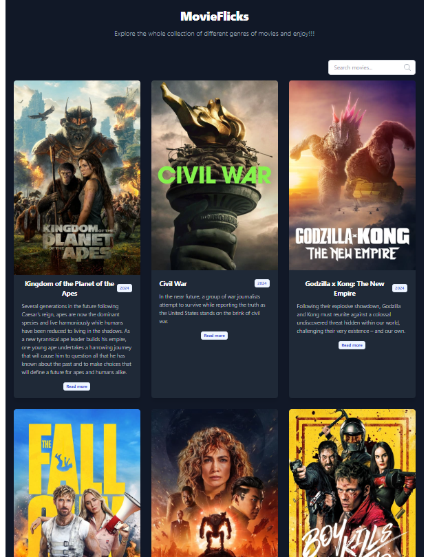
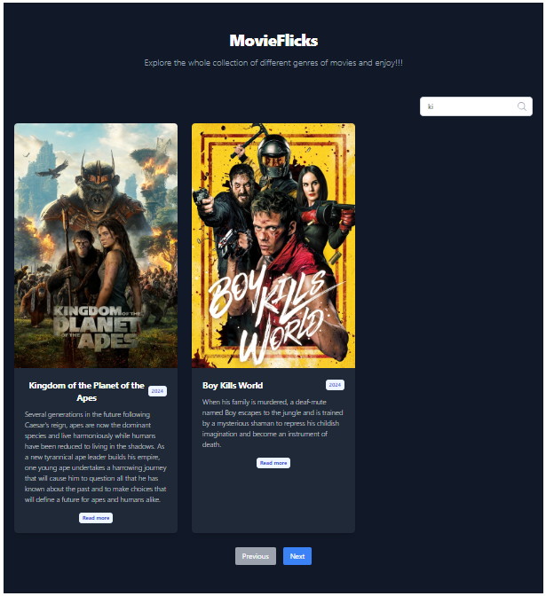
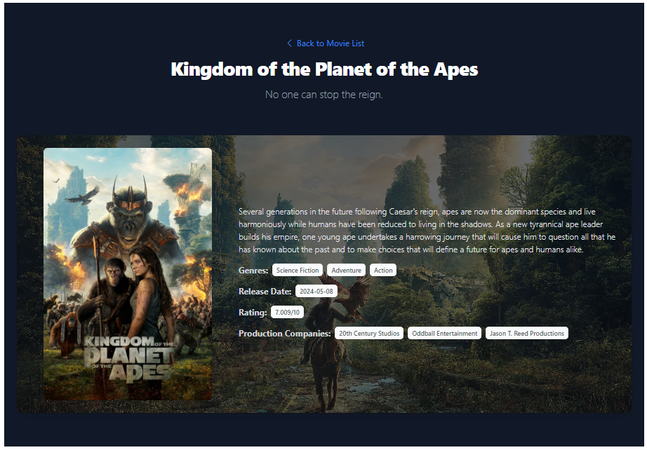

# MovieFlicks
A React-based web application that allows users to explore and discover popular movies. Leveraging the TMDB API, the app displays a list of movies with their titles, release years, and brief descriptions. Users can search for specific movies by title, view detailed information about each movie, and enjoy infinite scrolling for seamless navigation.

## Features

- Fetches popular movies from the TMDB API
- Displays movie cards with title, release year, and a brief description
- Search functionality to filter movies by title
- Pagination to navigate through pages of movies
- Detailed view of individual movies
- Responsive design with Tailwind CSS

## Screenshots

### Home Page


### Search Results


### Movie Details


## Installation

1. Clone the repository:
    ```bash
    git clone https://github.com/SudeepChaulagain/MovieFlicks.git
    ```

2. Navigate to the project directory:
    ```bash
    cd MovieFlicks
    ```

3. Install dependencies:
    ```bash
    npm install
    ```

4. Create a `.env` file in the root directory and add your TMDB API key:
    ```
    VITE_TMDB_API_KEY=your_api_key_here
    ```

5. Start the development server:
    ```bash
    npm run dev
    ```

6. Open your browser and navigate to `http://localhost:3000`.

## Usage

- Use the search box on the top right corner to filter movies by title.
- Click on a movie card to view detailed information about the movie.
- Use the pagination controls to navigate through pages of movies.

## Technologies Used

- React
- Tailwind CSS
- Axios
- React Query
- Vite

## Contributing

Contributions are welcome! Please open an issue or submit a pull request for any improvements or bug fixes.

## License

This project is licensed under the MIT License.

## Acknowledgements

- [TMDB API](https://www.themoviedb.org/documentation/api) for providing movie data
- [Heroicons](https://heroicons.com/) for the icons used in the project

## Contact

For any questions or feedback, please contact me at sudeepchaulagain7777@gmail.com.